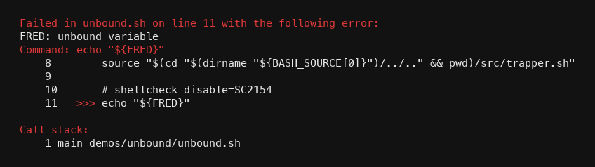
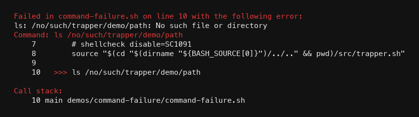
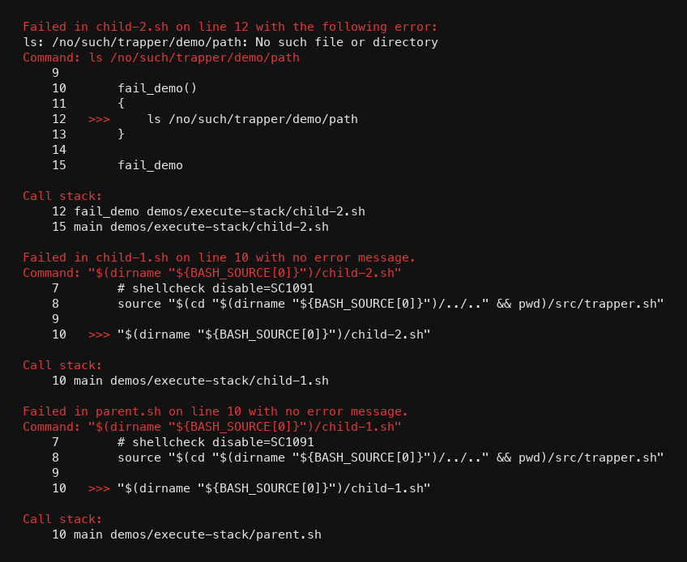
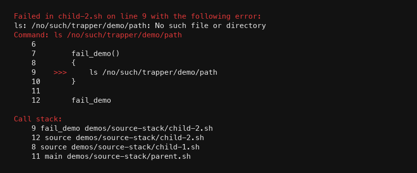

<p align="center">
  <a href="https://github.com/lupaxa-developers-toolbox">
    
  </a>
</p>

<h1 align="center">Trapper</h1>

A sourceable Bash plugin for debugging scripts. Source it near the top of a
script; it installs `ERR` and `EXIT` traps and, on failure, prints the
filename, line number, error message, failing command, a short code snippet,
and the call stack.

`trapper.sh` must be sourced, not executed. By default it turns on
`set -Eeuo pipefail`. Set `TRAPPER_SET_STRICT=0` before sourcing if the host
script already manages `set` options.

Colour follows `NO_COLOR`, `FORCE_COLOR`, and whether stdout is a TTY.

## Use

```bash
source src/trapper.sh
```

Trapper can report errors in several layouts:

| Scenario          | Requirements                            | Results                                                                             |
| :---------------- | :-------------------------------------- | :---------------------------------------------------------------------------------- |
| Single script     | Include `trapper.sh`                    | Reports filename, line number, command, snippet, and stack.                         |
| Executing scripts | Include `trapper.sh` in every script    | Each process reports its own failure; the parent then reports the failing child.    |
| Including scripts | Include `trapper.sh` only in the parent | Reports filename, line number, snippet, and stack of the failing sourced script.    |

## Demos

Each demo lives in its own directory under `demos/`. Run the entry script
from any working directory. They are meant to fail.

### Unset (unbound) variables

[demos/unbound/unbound.sh](demos/unbound/unbound.sh)



### Command failure

A missing path, so the `ERR` trap sees real stderr:

[demos/command-failure/command-failure.sh](demos/command-failure/command-failure.sh)



### Execute stack

A parent that runs child scripts, with the error in the last child:

[demos/execute-stack/parent.sh](demos/execute-stack/parent.sh)



### Source stack

A parent that sources child scripts, with the error in the last child:

[demos/source-stack/parent.sh](demos/source-stack/parent.sh)



## Development

```bash
make init   # first-time makefile-skills checkout
make check  # bash -n, ShellCheck, and tests/run_all.sh
```

<a href="https://github.com/the-lupaxa-project">
  
</a>
